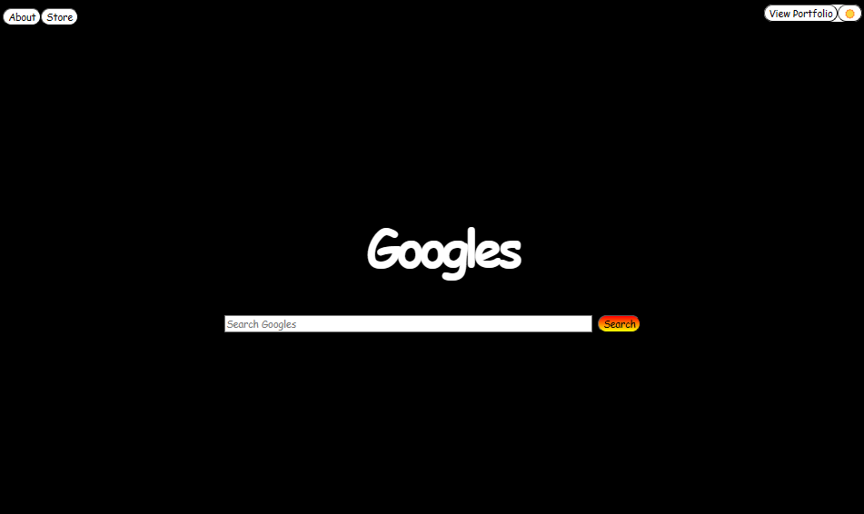

hello! 

this is my personal project! it is basically mocking google.com homepage!

this project incorporates html, css, -- used so far 

future techs to use: js, node(duh), routes/express, insomnia

this is my learning log, all the difficulties, obstacles, successes are all listed down below...

future implementations: 

darkmode ✅
catching different kinds of errors:
    if search bar is empty -- search for something msg 
    more to come...!!!
set up routes 
add different colors to google text
    -adding ids to each letter 
working buttons via js 
multiple pages via express/routes 
use some kind of api 
test out routes via insomnia 
more to come...!!! 
add google calendar api for users who visit website

learning log/progress tracker---------------------------------------------------------

day 1 8.29.2024 @ 1:23am 

comments:
really wanted to create a mock up of google, turned out decent...more to come! 

day 2 8.29.2024 @ 11:59pm

comments: 
created another html page for my professional portfolio, incorporating js for now 

day3 10.2.2024 @ 10:43pm

comments: 
added darkmode functionality to website...still need to fix some bugs...centering items is getting easier  

i hope to land a job as an entry level full stack web developer or something along those lines! as long as i get paid for it! 

command.log('i have finally found my passion in coding!')

